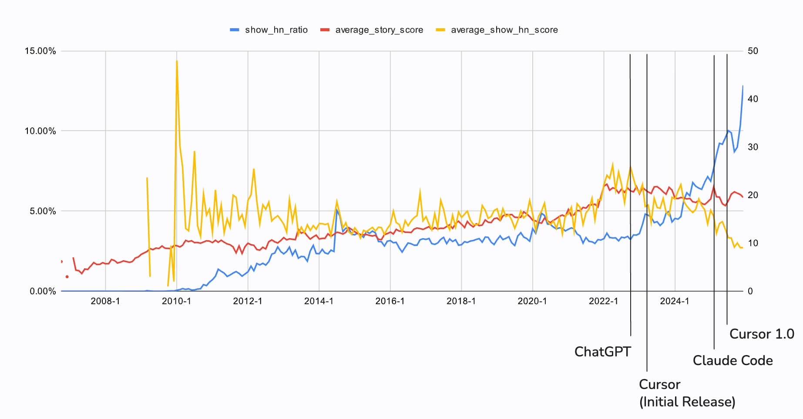

Last update: 2026-01-14

Recently, I felt like I was seeing more "Show HN" stories, and many of which were generated with LLMs. So I analyzed the data to see if that was true. Also I included the average score per month to see if people enjoy seeing them (because I don't :P).

## Charts

Stories in 2026 was omitted. 1) It's only 13 days, 2) Scores are not stable yet.

Left axis: `show_hn_ratio`(`show_hn / story * 100`)

Right axis: `average_show_hn_score` and `average_story_score`


With LLM timeline



## Analysis

> Disclaimer: I am neither a data scientist nor a statistician. Some nuances may have been lost in translation.

### Percentage

For about ten years (2012~2022), the percentage of Show HN stories was around 2-3%. Then, with the appearance of LLMs that can code, it's been increasing. Claude Code and Cursor 1.0 accelerated it even more. As of December 2025, over 12% of all stories are Show HNs. It's safe to say that there is a correlation between the increase in Show HN posts and LLM. People can create great things even if they don't know how to code at all.

### Scores

Show HN stories used to receive similar scores (around 15-18) to those of all stories until 2023~2024. However, it's been declining while percentage of them are going up. As of December 2025, the average Show HN score is 10 points lower (9.04 vs 19.53).

Does it mean LLM-generated Show HNs are lower quality? I'm not sure. Maybe people are tired of seeing too many Show HNs.

Also I have no idea why the average score was increased in 2022. A lot of new users?

## Data and codes

You can find python code and csv in https://github.com/plastic041/hackernews.

I exported [BigQuery hacker news data](https://console.cloud.google.com/marketplace/product/y-combinator/hacker-news) to csv using this query:

```sql
SELECT
  `time`,
  `title`,
  `type`,
  `score`,
  `id`
FROM
  `bigquery-public-data.hacker_news.full`
WHERE
  (`type` IN ('story')) and title IS NOT NULL;
```

The `type` field in BigQuery does not have a `show_hn` attribute like the Algolia API, so I lowercased titles and filtered using [`starts_with("show_hn: ")`](https://docs.pola.rs/api/python/dev/reference/expressions/api/polars.Expr.str.starts_with.html) to determine if a post is a Show HN story.

I didn't commit to the repo the original CSV because it was too big (~400 MB) but you can download it from BigQuery for free (I didn't set billing account). I ran SQL above, exported it to google drive, and downloaded it.

I would like to analyze the percentage of Show HN stories generated with LLMs but I couldn't find the way to do this, because many Show HN stories don't mention that they've used LLMs in their text.

I'll try to update this article every few months.
